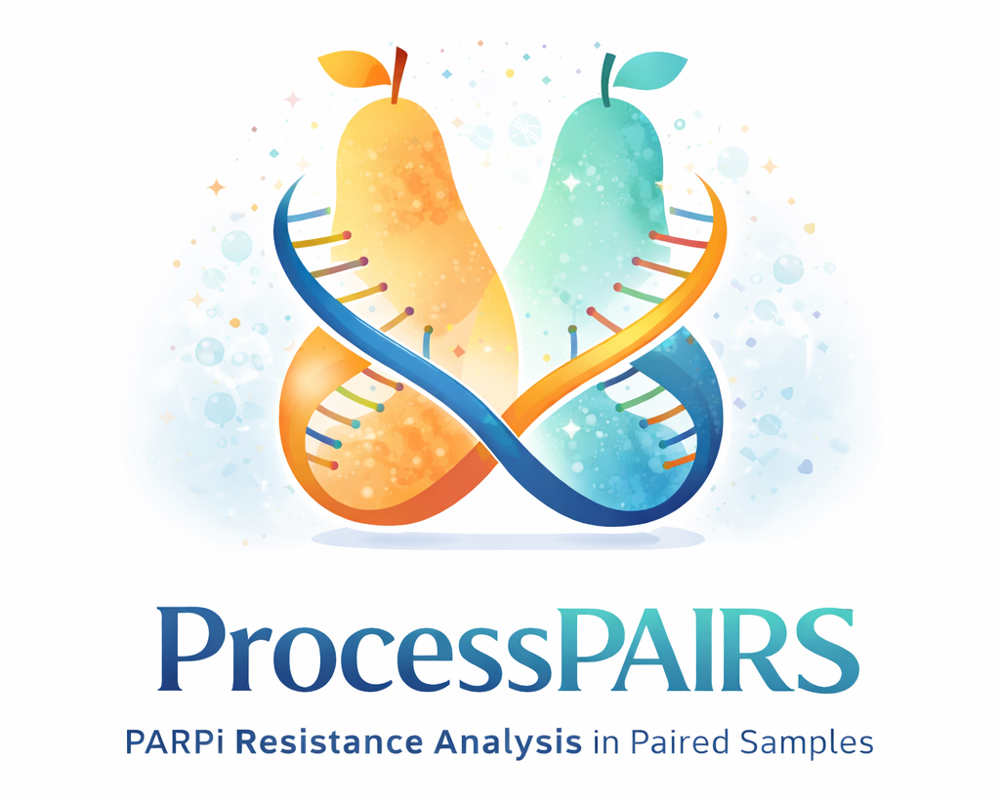

# ProcessPAIRS

**ProcessPAIRS — PARPi Resistance Analysis in Paired Samples**

ProcessPAIRS is an R function designed to analyze clonal evolution and detect PARP inhibitor (PARPi) resistance mechanisms in paired high-grade serous ovarian cancer (HGSOC) patient samples. It integrates SNV (MAF) and CNV data across germline (gDNA), pre-treatment, and post-relapse samples to track mutation clusters, identify resistance events (e.g., BRCA1/2 reversions, HRD restoration, TP53BP1/RAD51 alterations), and generate patient-level summaries and visualizations.

The logo reflects the paired sample concept with two stylized pears wrapped by a DNA helix, highlighting the evolutionary and genomic tracking focus of the package.

---

## Features

- Integrates SNV and CNV data across paired samples.
- Assigns mutation clusters (A–F) to track clonal evolution.
- Detects PARPi resistance mechanisms.
- Generates summary tables and visualizations (alluvial plots, VAF density plots, CNV evolution).
- Optional mutational signature (SBS03) analysis for deeper mechanistic insight.

---

## Installation

Clone the repository to your local machine:

```bash
git clone https://github.com/<your-username>/ProcessPAIRS.git
